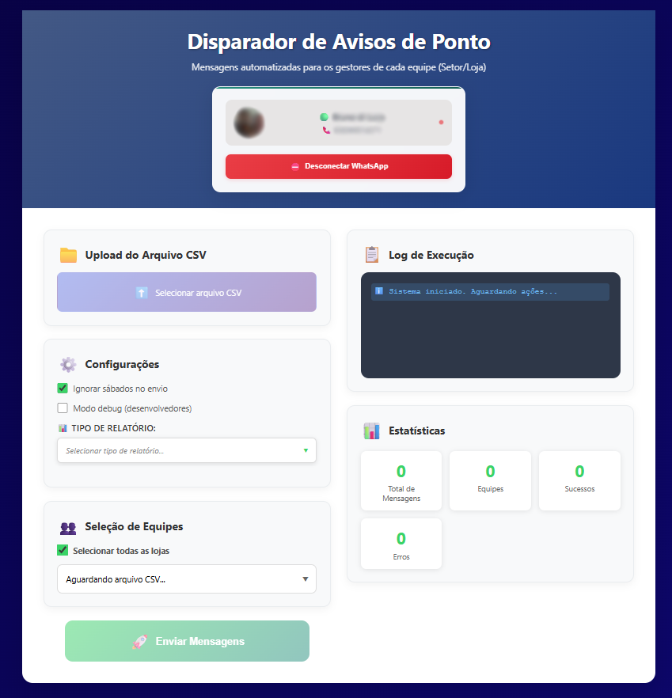
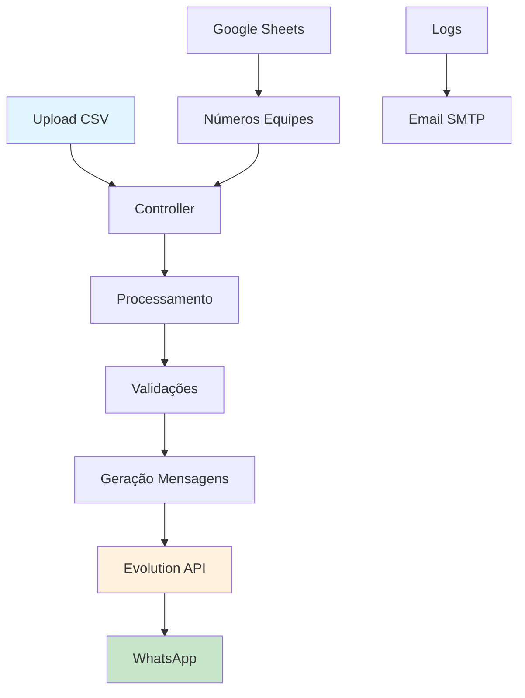

# TopFama - Disparador de Mensagens PontoMais

> Automação inteligente de avisos de ponto via WhatsApp para gestores

## Índice

- [Descrição](#descrição)
- [Status do Projeto](#status-do-projeto)
- [Demonstração](#demonstração)
- [Tecnologias](#tecnologias)
- [Arquitetura](#arquitetura)
- [Instalação](#instalação)
- [Uso](#uso)
- [Testes](#testes)
- [Roadmap](#roadmap)
- [Contribuindo](#contribuindo)
- [Licença](#licença)
- [Contato](#contato)
- [Agradecimentos](#agradecimentos)

## Descrição

O **Disparador de Aviso de Ponto** é uma solução web que automatiza o envio de mensagens WhatsApp para gestores sobre irregularidades no sistema de ponto eletrônico. A aplicação processa relatórios CSV gerados pelo PontoMais, identifica faltas, atrasos e outras ocorrências, e envia notificações personalizadas para cada equipe/loja.

### Principais funcionalidades:
- 📊 Processamento automatizado de relatórios CSV (Auditoria e Ocorrências)
- 💬 Integração com WhatsApp via Evolution API
- 🎯 Envio direcionado por equipe/loja
- ⚙️ Interface intuitiva com configurações flexíveis
- 📋 Log detalhado de execução
- 📈 Dashboard com estatísticas

### Problema que resolve:
Elimina o trabalho manual de análise de relatórios de ponto e notificação individual de gestores, reduzindo erros humanos e garantindo que todas as irregularidades sejam comunicadas de forma rápida e organizada.

## Status do Projeto

✅ **Estável e em Produção**

O sistema está operacional e sendo usado ativamente pela TopFama para gestão de ponto de múltiplas lojas. Novas funcionalidades são adicionadas conforme a necessidade.

## Demonstração


*Tela de conexão com WhatsApp via QR Code*


*Interface principal com upload de CSV e configurações*

## Tecnologias

### Backend
- **Python 3.9+** - Linguagem principal
- **Flask** - Framework web minimalista
- **Pandas** - Processamento de dados CSV
- **Requests** - Cliente HTTP para Evolution API
- **Python-dotenv** - Gerenciamento de variáveis de ambiente

### Frontend
- **HTML5/CSS3** - Interface responsiva
- **JavaScript ES6+** - Lógica client-side modular
- **CSS Grid/Flexbox** - Layout responsivo
- **Drag & Drop API** - Upload intuitivo de arquivos

### Integração
- **Evolution API** - Gateway WhatsApp
- **SMTP** - Envio de logs por email
- **Google Sheets API** - Configuração de números de equipes

### Infraestrutura
- **Docker** - Containerização (opcional)
- **Gunicorn** - Servidor WSGI para produção
- **Nginx** - Proxy reverso e servir arquivos estáticos

## Arquitetura



<details>
<summary>Detalhes da Arquitetura</summary>

### Fluxo Principal:
1. **Upload**: Interface recebe arquivo CSV via drag-and-drop ou seleção
2. **Processamento**: Sistema identifica tipo de relatório e valida estrutura
3. **Mapeamento**: Equipes são categorizadas (CD, Lojas, Departamentos)
4. **Mensagens**: Templates personalizados por tipo de ocorrência
5. **Envio**: Integração com Evolution API para WhatsApp
6. **Logs**: Rastreamento completo com envio por email em caso de erro

### Componentes Principais:
- `controller.py` - Orquestração do fluxo principal
- `csv_reader.py` - Parser especializado para PontoMais
- `mensagem.py` - Templates e formatação de mensagens
- `whatsapp.js` - Cliente frontend para Evolution API
</details>

## Instalação

### Pré-requisitos

- Python 3.9 ou superior
- Node.js 16+ (para desenvolvimento frontend)
- Evolution API configurada e rodando
- Conta Google com Sheets API habilitada (opcional)

### Instalação Local

1. **Clone o repositório:**
```bash
git clone https://github.com/DiLucaYVL/disparador_wpp_pontomais.git
cd disparador-ponto
```

2. **Crie um ambiente virtual:**
```bash
python -m venv venv
source venv/bin/activate  # Linux/Mac
# ou
venv\Scripts\activate     # Windows
```

3. **Instale as dependências:**
```bash
pip install -r requirements.txt
```

4. **Configure as variáveis de ambiente:**
```bash
cp .env.example .env
# Edite o arquivo .env com suas configurações
```

5. **Configure a Evolution API:**
```bash
# Edite static/config.json
{
  "EVOLUTION_URL": "http://localhost:8080",
  "EVOLUTION_INSTANCE": "seu-instance",
  "EVOLUTION_TOKEN": "seu-token"
}
```

### Instalação com Docker

```bash
# Build da imagem
docker build -t topfama-disparador .

# Executar container
docker run -d \
  --name disparador \
  -p 5000:5000 \
  --env-file .env \
  topfama-disparador
```

### Configuração de Produção

<details>
<summary>Deploy com Nginx e Gunicorn</summary>

```bash
# Instalar Gunicorn
pip install gunicorn

# Executar
gunicorn --bind 0.0.0.0:5000 --workers 4 main:app

# Configurar Nginx (exemplo)
server {
    listen 80;
    server_name seu-dominio.com;
    
    location / {
        proxy_pass http://localhost:5000;
        proxy_set_header Host $host;
        proxy_set_header X-Real-IP $remote_addr;
    }
    
    location /static {
        alias /caminho/para/static;
        expires 1d;
    }
}
```
</details>

## Uso

### 1. Conectar WhatsApp

Acesse a interface web e escaneie o QR Code com seu WhatsApp:

```javascript
// O sistema detecta automaticamente o status da conexão
// Interface é liberada apenas após conexão confirmada
```

### 2. Upload de Relatório

Faça upload do arquivo CSV gerado pelo PontoMais:

```bash
# Formatos suportados:
- Relatório de Auditoria (faltas, horas extras, etc.)
- Relatório de Ocorrências (ajustes pendentes, etc.)
```

### 3. Configurações

```javascript
// Opções disponíveis:
{
  "ignorarSabados": true,        // Ignora ocorrências de sábado
  "tipoRelatorio": "Auditoria",  // Auditoria ou Ocorrências
  "equipesSelecionadas": ["CD10", "LOJA 75", "RH"]  // Filtros opcionais
}
```

### 4. Execução

```python
# Exemplo de mensagem gerada automaticamente:
"""
*LOJA 75*

*NO DIA 15/01/2024:*
• João Silva faltou. Por favor justificar.
• Maria Santos fez mais de 2 horas extras. Total: 03:15. Por favor ajustar.

*NO DIA 16/01/2024:*
• Carlos Oliveira ficou devendo 02:30 horas. Por favor justificar.
"""
```

### API Endpoints

<details>
<summary>Endpoints Disponíveis</summary>

```bash
# Enviar mensagens
POST /enviar
Content-Type: multipart/form-data
{
  "csvFile": arquivo,
  "ignorarSabados": boolean,
  "tipoRelatorio": string,
  "equipesSelecionadas": array
}

# Obter equipes do CSV
POST /equipes
Content-Type: multipart/form-data
{
  "csvFile": arquivo,
  "tipoRelatorio": string
}

# Status da aplicação
GET /health
```
</details>

### Customização de Mensagens

```python
# Edite app/whatsapp/mensagem.py para personalizar templates:

TEMPLATES = {
    "Falta": "*{nome}* _faltou_. Por favor *justificar*.",
    "Horas extras": "*{nome}* fez mais de 2 horas extras. _Total_: *{valor}*. Por favor *ajustar*.",
    # Adicione novos templates conforme necessário
}
```

## Testes

### Executar Suite de Testes

```bash
# Instalar dependências de teste
pip install -r requirements-test.txt

# Executar todos os testes
python -m pytest tests/ -v

# Executar com cobertura
python -m pytest tests/ --cov=app --cov-report=html

# Testes específicos
python -m pytest tests/test_csv_reader.py -v
```

### Testes Manuais

```bash
# Testar processamento CSV
python tests/manual/test_csv_processing.py

# Testar envio WhatsApp (requer Evolution API)
python tests/manual/test_whatsapp_integration.py
```

### Estrutura de Testes

```
tests/
├── unit/                 # Testes unitários
│   ├── test_csv_reader.py
│   ├── test_mensagem.py
│   └── test_mapear_gerencia.py
├── integration/          # Testes de integração
│   ├── test_controller.py
│   └── test_whatsapp_api.py
├── fixtures/            # Dados de teste
│   ├── auditoria_sample.csv
│   └── ocorrencias_sample.csv
└── conftest.py          # Configuração pytest
```

## Roadmap

### 🚀 Próximas Versões

#### v2.2.0 - Q2 2024
- [ ] **Dashboard Analytics** - Métricas históricas de envios
- [ ] **Agendamento** - Execução automática por cronograma
- [ ] **Multi-tenancy** - Suporte a múltiplas empresas

#### v2.3.0 - Q3 2024  
- [ ] **API REST** - Endpoints para integração externa
- [ ] **Webhooks** - Notificações de status via callback
- [ ] **Telegram Integration** - Suporte alternativo ao WhatsApp

#### v2.4.0 - Q4 2024
- [ ] **Machine Learning** - Detecção inteligente de padrões
- [ ] **Mobile App** - Aplicativo para gestores
- [ ] **SSO Integration** - Login com Active Directory

### 💡 Backlog
- Suporte a outros sistemas de ponto (Ahgora, Pontomais Pro)
- Export de relatórios em PDF
- Integração com Microsoft Teams
- Plugin para Excel/Google Sheets

### 🐛 Correções Conhecidas
- Melhorar tratamento de CSV corrompidos
- Otimizar performance para arquivos grandes (>10k registros)
- Implementar retry automático para falhas de rede

## Contribuindo

Contribuições são muito bem-vindas! Veja nosso [Guia de Contribuição](CONTRIBUTING.md) para detalhes.

### Como Contribuir

1. **Fork** o projeto
2. Crie sua **feature branch** (`git checkout -b feature/nova-funcionalidade`)
3. **Commit** suas mudanças (`git commit -m 'Adiciona nova funcionalidade'`)
4. **Push** para a branch (`git push origin feature/nova-funcionalidade`)
5. Abra um **Pull Request**

### Diretrizes

- Siga o [PEP 8](https://pep8.org/) para código Python
- Adicione testes para novas funcionalidades
- Mantenha a cobertura de testes acima de 80%
- Documente mudanças na API em `docs/api.md`

### Reportar Bugs

Encontrou um problema? [Abra uma issue](https://github.com/TopFama/disparador-ponto/issues/new/choose) com:

- Descrição detalhada do problema
- Passos para reproduzir
- Screenshots (se aplicável)
- Ambiente (OS, Python version, etc.)

### Code of Conduct

Este projeto segue nosso [Código de Conduta](CODE_OF_CONDUCT.md). Ao participar, você concorda em mantê-lo.

## Licença

Este projeto está licenciado sob a Licença MIT - veja o arquivo [LICENSE](LICENSE) para detalhes.

```
MIT License

Copyright (c) 2024 TopFama

Permission is hereby granted, free of charge, to any person obtaining a copy...
```

## Contato

### Equipe de Desenvolvimento

- **João Silva** - *Tech Lead* - [@joaosilva](https://github.com/joaosilva)
- **Maria Santos** - *Full Stack* - [@mariasantos](https://github.com/mariasantos)
- **Carlos Oliveira** - *DevOps* - [@carlosoliveira](https://github.com/carlosoliveira)

### Canais de Suporte

- 📧 **Email**: suporte@topfama.com.br
- 💬 **Discord**: [TopFama Dev Community](https://discord.gg/topfama)
- 📱 **WhatsApp**: +55 (11) 9999-9999 (apenas questões urgentes)
- 🐛 **Issues**: [GitHub Issues](https://github.com/TopFama/disparador-ponto/issues)

### TopFama

- 🌐 **Website**: [topfama.com.br](https://topfama.com.br)
- 📍 **Endereço**: São Paulo, SP - Brasil
- 💼 **LinkedIn**: [@topfama](https://linkedin.com/company/topfama)

## Agradecimentos

### Inspirações e Referências

- [Flask Documentation](https://flask.palletsprojects.com/) - Framework web utilizado
- [Evolution API](https://github.com/EvolutionAPI/evolution-api) - WhatsApp Gateway
- [Pandas](https://pandas.pydata.org/) - Processamento de dados
- [PontoMais](https://pontomais.com.br/) - Sistema de ponto referência

### Ferramentas e Serviços

- [GitHub](https://github.com) - Hospedagem do código
- [Shields.io](https://shields.io) - Badges do README  
- [Mermaid](https://mermaid.js.org) - Diagramas de arquitetura
- [Font Awesome](https://fontawesome.com) - Ícones da interface

### Contribuidores

Um agradecimento especial a todos que contribuíram para este projeto:

[](https://github.com/TopFama/disparador-ponto/graphs/contributors)

### Comunidade

Obrigado à comunidade Python e Flask por todo suporte e documentação que tornou este projeto possível.

---

<div align="center">

### ⭐ Gostou do projeto? Deixe uma estrela!

### 🤝 Quer contribuir? Veja nossas [issues abertas](https://github.com/TopFama/disparador-ponto/issues)

### 📢 Compartilhe este projeto e ajude outros desenvolvedores!

**Feito com ❤️ pela equipe TopFama**

</div>