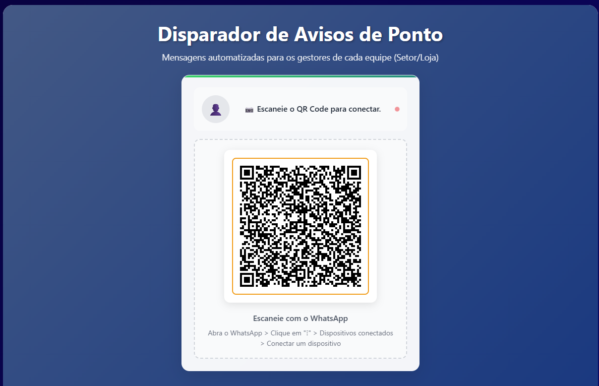
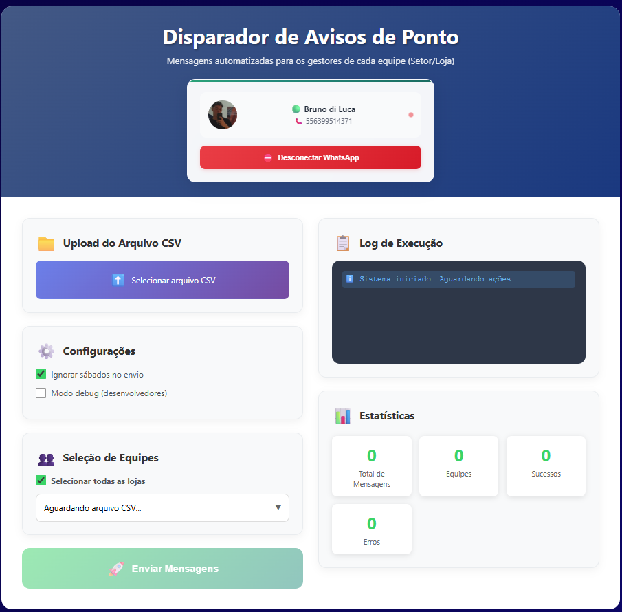

# 🚀 Disparador de Mensagens PontoMais – TopFama

Automatize o envio de **alertas de ponto** via WhatsApp para gestores da TopFama, com base em registros extraídos do sistema PontoMais. Desenvolvido para reduzir esforços manuais, garantir agilidade na comunicação e manter o compliance com a jornada de trabalho.

---

## 📌 Índice

- [📌 Índice](#-índice)
- [🧠 Visão Geral](#-visão-geral)
- [🖼️ Interface Visual](#️-interface-visual)
- [🛠️ Tecnologias Utilizadas](#️-tecnologias-utilizadas)
- [📁 Estrutura do Projeto](#-estrutura-do-projeto)
- [⚙️ Como Rodar o Projeto](#️-como-rodar-o-projeto)
- [📄 Sobre o Arquivo CSV do PontoMais](#-sobre-o-arquivo-csv-do-pontomais)
- [✅ Funcionalidades em Destaque](#-funcionalidades-em-destaque)
- [🧑‍💻 Contribuição Interna](#-contribuição-interna)
- [📄 Licença e Privacidade](#-licença-e-privacidade)
- [🌟 Mensagem Final](#-mensagem-final)

---

## 🧠 Visão Geral

Este sistema realiza:

- Upload e processamento inteligente de planilhas do PontoMais
- Agrupamento por colaborador e data com múltiplas ocorrências
- Mapeamento inteligente de equipes com nomes inconsistentes
- Geração de mensagens personalizadas conforme tipo de ocorrência
- Envio automático via API WAHA (gateway de WhatsApp)
- Interface intuitiva com feedback visual: QR Code, logs, progresso e estatísticas

🎯 **Objetivo:** Garantir que cada gestor receba os alertas de ocorrências da sua equipe de forma automatizada, confiável e personalizável.

---

## 🖼️ Interface Visual

| QR Code de Conexão | Interface após conexão |
|--------------------|------------------------|
|  |  |

---

## 🛠️ Tecnologias Utilizadas

### 🔹 Backend
- Python 3.10+
- Flask
- Pandas
- WAHA API (`requests`)
- Organização em Blueprints e módulos

### 🔹 Frontend
- HTML5 + CSS3 modular (por componente)
- JavaScript moderno (ES Modules)
- UI reativa e responsiva
- Fetch assíncrono e manipulação dinâmica do DOM

---

## 📁 Estrutura do Projeto

```
├── app/
│   ├── app.py
│   ├── routes.py
│   ├── controller.py
│   ├── processamento/
│   │   ├── csv_reader.py
│   │   ├── log.py
│   │   └── mapear_gerencia.py
│   └── whatsapp/
│       ├── mensagem.py
│       ├── enviar_mensagem.py
│       └── numeros_equipes.py
│
├── static
│   ├── css
│   │   ├── base.css
│   │   ├── connection-message.css
│   │   ├── dropdown.css
│   │   ├── forms.css
│   │   ├── header.css
│   │   ├── logs.css
│   │   ├── main-content.css
│   │   ├── qr-code.css
│   │   ├── responsive.css
│   │   ├── stats.css
│   │   └── whatsapp-status.css
│   └── js
│       ├── api.js
│       ├── dragdrop.js
│       ├── dropdown.js
│       ├── eventos.js
│       ├── helpers.js
│       ├── main.js
│       ├── ui.js
│       └── whatsapp.js
├── templates
│   └── index.html
│
├── log/
└── .env

```

---

## ⚙️ Como Rodar o Projeto

### 1. Clonar o repositório

```bash
git clone https://github.com/seu-usuario/seu-repositorio.git
cd seu-repositorio
```

### 2. Criar o ambiente virtual

```bash
python -m venv venv
source venv/bin/activate  # ou venv\Scripts\activate no Windows
```

### 3. Instalar as dependências

```bash
pip install -r requirements.txt
```

### 4. Criar o arquivo `.env`

```env
WAHA_URL=http://endereço-da-api-waha.com
WAHA_SESSION=nome_da_sessão
PLANILHA_EQUIPES_URL=https://docs.google.com/spreadsheets/...
```

### 5. Iniciar o servidor

```bash
python app.py
```

---

## 📄 Sobre o Arquivo CSV do PontoMais

O sistema processa arquivos `.CSV` exportados do relatório de **Ocorrências** do PontoMais.

### 🔎 Exemplo de colunas

| Nome                        | Equipe                             | Data            | Ocorrência         | Valor  |
|-----------------------------|-------------------------------------|------------------|---------------------|--------|
| Nome do funcionário | Departamento do funcionário   | Sáb, 05/07/2025 | Falta               |        |
| Nome do funcionário | Departamento do funcionário   | Sáb, 05/07/2025 | Horas Faltantes     | 04:00  |
| Nome do funcionário | Departamento do funcionário   | Sáb, 11/07/2025 | Mais de duas horas extras     | 02:01  |

### 🧠 Regras Aplicadas

- Ignora as 3 primeiras e 12 últimas linhas do CSV
- Ignora **faltas justificadas** (ex: “abonada”)
- Remove registros de sábado com falta ou 04:00h (opcional)
- Mapeia nomes de equipe com base em regras, regex e exceções conhecidas
- Agrupa ocorrências por colaborador + data para gerar uma mensagem única por grupo

### ✉️ Exemplo de Mensagem

```
*EQUIPE Departamento*

*NO DIA 05/07/2025:*
• Nome do funcionário _faltou e ficou devendo_ 04:00 horas. Foi verificado o motivo da falta?

*NO DIA 11/07/2025:*
• Nome do funcionário fez mais de 2 horas extras. _Total acumulado_: 02:01. Foi autorizado previamente?
```

---

## ✅ Funcionalidades em Destaque

- [x] QR Code dinâmico para autenticação do WhatsApp
- [x] Upload de CSV com validações robustas
- [x] Filtros configuráveis (ex: ignorar sábados)
- [x] Modo Debug para análise dos dados tratados
- [x] Dropdown interativo para seleção de equipes
- [x] Mensagens customizadas por tipo de ocorrência
- [x] Log visual com status por equipe
- [x] Painel de estatísticas com contadores atualizados em tempo real

---

## 🧑‍💻 Contribuição Interna

Para membros da equipe TopFama Tech:

1. Crie uma branch com seu nome ou funcionalidade
2. Faça alterações localmente e rode com `debug=True`
3. Submeta PR para revisão com descrição clara do que foi alterado
4. Use `log/` para validar execuções e o modo debug para validação do dataframe

---

## 📄 Licença e Privacidade

Este projeto é de **uso exclusivo e interno da TopFama**.  
Reprodução, redistribuição ou exposição pública não autorizada é proibida.

---

## 🌟 Mensagem Final

> *“Lugar de Gente Feliz. Agora, também com código limpo.”*  
> *"Feito por Bruno di Luca | TopFama | OPS" |*
> Contato: bruno@grupotopfama.com.br
> 
