# TopFama - Disparador de Mensagens PontoMais

> Automação de avisos de ponto via WhatsApp para gestores.

## Índice

- [Descrição](#descrição)
- [Status do Projeto](#status-do-projeto)
- [Demonstração](#demonstração)
- [Tecnologias](#tecnologias)
- [Arquitetura](#arquitetura)
- [Instalação](#instalação)
- [Uso](#uso)
- [Testes](#testes)
- [Roadmap](#roadmap)
- [Contribuindo](#contribuindo)
- [Licença](#licença)
- [Contato](#contato)
- [Agradecimentos](#agradecimentos)

## Descrição

O **Disparador de Aviso de Ponto** é uma solução web que automatiza o envio de mensagens WhatsApp para gestores sobre irregularidades no sistema de ponto eletrônico. A aplicação processa relatórios CSV gerados pelo PontoMais, identifica faltas, atrasos e outras ocorrências, e envia notificações personalizadas para cada equipe/loja.

### Principais funcionalidades:
- 📊 Processamento automatizado de relatórios CSV (Auditoria e Ocorrências)
- 💬 Integração com WhatsApp via Evolution API
- 🎯 Envio direcionado por equipe/loja
- ⚙️ Interface intuitiva com configurações flexíveis
- 📋 Log detalhado de execução
- 📈 Dashboard com estatísticas

### Problema que resolve:
Elimina o trabalho manual de análise de relatórios de ponto e notificação individual de gestores, reduzindo erros humanos e garantindo que todas as irregularidades sejam comunicadas de forma rápida e organizada.

## Status do Projeto

✅ **Estável e em Produção**

O sistema está operacional e sendo usado ativamente pela TopFama para gestão de ponto de múltiplas lojas. Novas funcionalidades são adicionadas conforme a necessidade.

## Demonstração


*Tela de conexão com WhatsApp via QR Code*


*Interface principal com upload de CSV e configurações*

## Tecnologias

### Backend
- **Python 3.9+** - Linguagem principal
- **Flask** - Framework web minimalista
- **Pandas** - Processamento de dados CSV
- **Requests** - Cliente HTTP para Evolution API
- **Python-dotenv** - Gerenciamento de variáveis de ambiente

### Frontend
- **HTML5/CSS3** - Interface responsiva
- **JavaScript ES6+** - Lógica client-side modular
- **CSS Grid/Flexbox** - Layout responsivo
- **Drag & Drop API** - Upload intuitivo de arquivos

### Integração
- **Evolution API** - Gateway WhatsApp
- **SMTP** - Envio de logs por email
- **Google Sheets API** - Configuração de números de equipes

### Infraestrutura
- **Docker** - Containerização (opcional)
- **Gunicorn** - Servidor WSGI para produção
- **Nginx** - Proxy reverso e servir arquivos estáticos

## Arquitetura

```mermaid
graph TB
    A[Upload CSV] --> B[Controller]
    B --> C[Processamento]
    C --> D[Validações]
    D --> E[Geração Mensagens]
    E --> F[Evolution API]
    F --> G[WhatsApp]
    
    H[Google Sheets] --> I[Números Equipes]
    I --> B
    
    J[Logs] --> K[Email SMTP]
    
    style A fill:#e1f5fe
    style G fill:#c8e6c9
    style F fill:#fff3e0
```



<details>
<summary>Detalhes da Arquitetura</summary>

### Fluxo Principal:
1. **Upload**: Interface recebe arquivo CSV via drag-and-drop ou seleção
2. **Processamento**: Sistema identifica tipo de relatório e valida estrutura
3. **Mapeamento**: Equipes são categorizadas (CD, Lojas, Departamentos)
4. **Mensagens**: Templates personalizados por tipo de ocorrência
5. **Envio**: Integração com Evolution API para WhatsApp
6. **Logs**: Rastreamento completo com envio por email em caso de erro

### Componentes Principais:
- `controller.py` - Orquestração do fluxo principal
- `csv_reader.py` - Parser especializado para PontoMais
- `mensagem.py` - Templates e formatação de mensagens
- `whatsapp.js` - Cliente frontend para Evolution API
</details>

## Instalação

### Pré-requisitos

- Python 3.9 ou superior
- Node.js 16+ (para desenvolvimento frontend)
- Evolution API configurada e rodando
- Conta Google com Sheets API habilitada (opcional)

### Instalação Local

1. **Clone o repositório:**
```bash
git clone https://github.com/DiLucaYVL/disparador_wpp_pontomais.git
cd disparador-ponto
```

2. **Crie um ambiente virtual:**
```bash
python -m venv venv
source venv/bin/activate  # Linux/Mac
# ou
venv\Scripts\activate     # Windows
```

3. **Instale as dependências:**
```bash
pip install -r requirements.txt
```

4. **Configure as variáveis de ambiente:**
```bash
cp .env.example .env
# Edite o arquivo .env com suas configurações
```

5. **Configure a Evolution API:**
```bash
# Edite static/config.json
{
  "EVOLUTION_URL": "http://localhost:8080",
  "EVOLUTION_INSTANCE": "seu-instance",
  "EVOLUTION_TOKEN": "seu-token"
}
```

### Instalação com Docker

```bash
# Build da imagem
docker build -t topfama-disparador .

# Executar container
docker run -d \
  --name disparador \
  -p 5000:5000 \
  --env-file .env \
  topfama-disparador
```

### Configuração de Produção

<details>
<summary>Deploy com Nginx e Gunicorn</summary>

```bash
# Instalar Gunicorn
pip install gunicorn

# Executar
gunicorn --bind 0.0.0.0:5000 --workers 4 main:app

# Configurar Nginx (exemplo)
server {
    listen 80;
    server_name seu-dominio.com;
    
    location / {
        proxy_pass http://localhost:5000;
        proxy_set_header Host $host;
        proxy_set_header X-Real-IP $remote_addr;
    }
    
    location /static {
        alias /caminho/para/static;
        expires 1d;
    }
}
```
</details>

## Uso

### 1. Conectar WhatsApp

Acesse a interface web e escaneie o QR Code com seu WhatsApp:

```javascript
// O sistema detecta automaticamente o status da conexão
// Interface é liberada apenas após conexão confirmada
```

### 2. Upload de Relatório

Faça upload do arquivo CSV gerado pelo PontoMais:

```bash
# Formatos suportados:
- Relatório de Auditoria (faltas, horas extras, etc.)
- Relatório de Ocorrências (ajustes pendentes, etc.)
```

### 3. Configurações

```javascript
// Opções disponíveis:
{
  "ignorarSabados": true,        // Ignora ocorrências de sábado
  "tipoRelatorio": "Auditoria",  // Auditoria ou Ocorrências
  "equipesSelecionadas": ["CD10", "LOJA 75", "RH"]  // Filtros opcionais
}
```

### 4. Execução

```python
# Exemplo de mensagem gerada automaticamente:
"""
*LOJA 75*

*NO DIA 15/01/2024:*
• João Silva faltou. Por favor justificar.
• Maria Santos fez mais de 2 horas extras. Total: 03:15. Por favor ajustar.

*NO DIA 16/01/2024:*
• Carlos Oliveira ficou devendo 02:30 horas. Por favor justificar.
"""
```

### API Endpoints

<details>
<summary>Endpoints Disponíveis</summary>

```bash
# Enviar mensagens
POST /enviar
Content-Type: multipart/form-data
{
  "csvFile": arquivo,
  "ignorarSabados": boolean,
  "tipoRelatorio": string,
  "equipesSelecionadas": array
}

# Obter equipes do CSV
POST /equipes
Content-Type: multipart/form-data
{
  "csvFile": arquivo,
  "tipoRelatorio": string
}

# Status da aplicação
GET /health
```
</details>

### Customização de Mensagens

```python
# Edite app/whatsapp/mensagem.py para personalizar templates:

TEMPLATES = {
    "Falta": "*{nome}* _faltou_. Por favor *justificar*.",
    "Horas extras": "*{nome}* fez mais de 2 horas extras. _Total_: *{valor}*. Por favor *ajustar*.",
    # Adicione novos templates conforme necessário
}
```

## Testes

### Executar Suite de Testes

```bash
# Instalar dependências de teste
pip install -r requirements-test.txt

# Executar todos os testes
python -m pytest tests/ -v

# Executar com cobertura
python -m pytest tests/ --cov=app --cov-report=html

# Testes específicos
python -m pytest tests/test_csv_reader.py -v
```

### Testes Manuais

```bash
# Testar processamento CSV
python tests/manual/test_csv_processing.py

# Testar envio WhatsApp (requer Evolution API)
python tests/manual/test_whatsapp_integration.py
```

### Estrutura de Testes

```
tests/
├── unit/                 # Testes unitários
│   ├── test_csv_reader.py
│   ├── test_mensagem.py
│   └── test_mapear_gerencia.py
├── integration/          # Testes de integração
│   ├── test_controller.py
│   └── test_whatsapp_api.py
├── fixtures/            # Dados de teste
│   ├── auditoria_sample.csv
│   └── ocorrencias_sample.csv
└── conftest.py          # Configuração pytest
```
